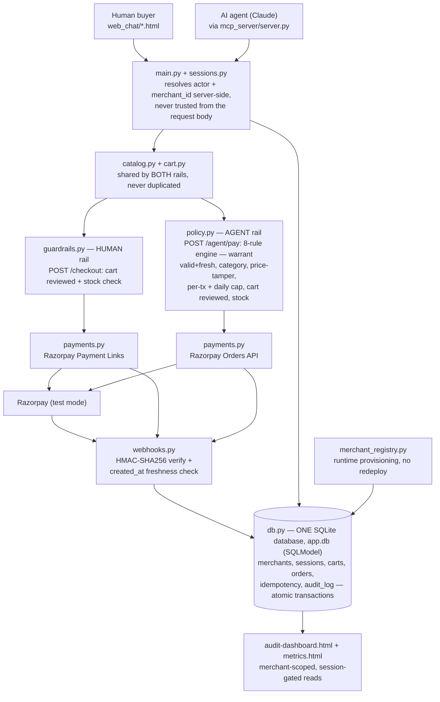

# Agentic Commerce for the Small Merchant
**Razorpay AI Buildathon 2026 — Track 1: AI Growth & Agentic Commerce**

[](https://github.com/ayushanand27/razorpay-buildathon/actions/workflows/tests.yml)
[](https://www.python.org/downloads/)
[](LICENSE)

## What this is

One merchant backend, **two front doors**:

1. **A human buyer**, chatting on a WhatsApp-style interface
2. **An AI buyer** (any MCP-compatible agent), completing a
   purchase autonomously through an MCP server

Both hit the **exact same** cart, catalog, and audit-trail logic —
there is no separate "toy" path for the AI demo. Payment itself is
split into two rails on purpose (a human has a browser to pay in; an
AI agent doesn't): the human pays via a Razorpay Payment Link
(`POST /checkout`), the AI agent pays via the Razorpay Orders API,
evaluated by its own deterministic policy engine and self-completed
immediately (`POST /agent/pay`) — see `backend/app/policy.py`. That's
the point either way: it proves this merchant is genuinely
transactable by both a person and an AI agent end to end, not just
chat-assisted.

This is built to mirror the pattern Razorpay itself is already
piloting — Razorpay + NPCI's agentic-UPI pilot with Zomato,
Swiggy and Zepto (Feb 2026), and the direction NPCI's own Unified
Agent Protocol is heading (consent + a registered spending cap,
rather than per-transaction OTP).

## Why this architecture

The track's stated bar is:
> "Every money action explainable, bounded and gated. Show the audit
> trail and one failure handled gracefully."

Each word of that maps directly to a module:

| Requirement | Where it lives |
|---|---|
| Explainable | `backend/app/audit.py` — every action, from any actor, is appended to an audit log with actor, amount, status, and reason. Every AGENT-rail payment decision (allow AND block) is additionally logged in full by `backend/app/policy.py` as a `policy_decision` entry — the exact JSON an agent can retrieve itself via `explain_last_block()`. Payment confirmation is tracked separately from order/link creation: `backend/app/webhooks.py` verifies an HMAC signature over the raw body (real Razorpay webhook OR the local `/demo/simulate-capture` stand-in — same verification function, same secret) and logs the confirmed payment as its own `payment_confirmed` entry |
| Bounded | `backend/app/policy.py` — AI-agent purchases are capped per-transaction AND cumulatively per day, every SKU must be in the warrant's allowed categories, and the server-computed total must match what the cart's own line items claim (a price-tamper check) — all read from a signed spending warrant re-verified on every single attempt, not a client-claimed value or a one-time check at session creation. Stock is checked per line item on both rails, and only ever decremented at payment-capture time, never at order-creation time (`backend/app/orders.py`, `backend/app/catalog.py`) |
| Gated | `backend/app/main.py` — both `/checkout` and `/agent/pay` require a valid session established via `POST /session/human` or `POST /session/agent` (the actor is never taken from the request body, so it can't be spoofed), AND a prior `GET /cart/{session_id}` review that's invalidated by any later cart mutation, not just checked once |
| One failure, handled gracefully | `backend/app/payments.py` — `create_order_with_retry()` (human rail only); trigger it via `simulate_failure=True` on the checkout call. The first attempt is a genuinely invalid request (amount=0) that Razorpay's real API genuinely rejects with a real 400; the system catches it, retries with the corrected amount, and logs both response bodies to the audit trail |
| AI Growth (quantified) | `backend/app/metrics.py` + `web_chat/metrics.html` — captured revenue (payment_confirmed only, not merely order/link-created, across BOTH rails), conversion rate, and upsell acceptance computed live from the audit trail |

## Architecture



Single source of truth = the FastAPI backend, backed by one SQLite
database (`backend/app/app.db`, via SQLAlchemy/SQLModel — see
"Persistence" below). Catalog, cart, and audit logic are never
duplicated between the two front doors; payment is deliberately split
into two rails (human vs. agent) with their own guard modules, since a
browser-based Payment Link and an agent-appropriate
Orders-API-plus-policy-check are genuinely different shapes of "pay
for this." Every merchant — including one provisioned at runtime via
`POST /merchants`, not just the two seeded demo merchants — flows
through this exact same diagram; nothing here is hardcoded per-tenant.

## Stack (100% free, no paid tools used to build this)

- Python + FastAPI — backend
- SQLite — audit trail (built into Python, no external DB needed)
- Official `mcp` Python SDK — MCP server
- Plain HTML/JS — human-buyer chat simulation (swap for the real
  WhatsApp Business/Twilio Sandbox API later — Twilio's WhatsApp
  Sandbox is free for dev/testing)
- Razorpay **test-mode** API keys — free, no real money moves
- Any MCP-compatible desktop client (a free-tier one works fine) —
  used as the MCP client to demo the AI-buyer flow live

## Running it locally

### 1. Backend
```bash
cd backend
python3 -m venv venv && source venv/bin/activate   # Windows: venv\Scripts\activate
pip install -r requirements.txt
cp ../.env.example ../.env   # fill in Razorpay TEST keys, or leave blank for mock mode
uvicorn app.main:app --port 8123
```
`.env` also carries `AGENT_WARRANT_SECRET`, `FIT_SUPPLY_WARRANT_SECRET`,
and `RAZORPAY_WEBHOOK_SECRET`, which — unlike the Razorpay API keys —
are required, not optional: the first two are what an AI-agent session
at each of the two demo merchants is authorized against (see
"Multi-tenancy" below), the third is what a payment capture (real or
simulated) is verified against. Working demo defaults ship in
`.env.example`; generate your own with `python -c "import secrets;
print(secrets.token_hex(24))"` for anything beyond a local demo.

Run the test suite (entirely in mock mode, no keys or network needed):
```bash
pytest
```

### 2. Human buyer demo
Just open `web_chat/index.html` in a browser (backend must be running).
Try: `catalog` → `add sku_001` → `cart` → `checkout`, and separately
`fail demo` to see the graceful-retry path. Two more pages sit alongside
it (same nav strip to jump between all three): `web_chat/catalog.html`
is a live product grid, and `web_chat/audit-dashboard.html` is a
readable, auto-refreshing view of the audit trail.

Anything typed that isn't one of those exact commands goes to
`POST /nlu/turn` (`backend/app/nlu.py`) — Groq-powered intent
classification restricted to a fixed tool set (`browse`, `add`,
`remove`, `view_cart`, `checkout`, `clarify`); it is never trusted for
a price or an allow/block decision, and every tool it picks is
executed through the exact same cart/checkout functions the hardcoded
commands call, so every guardrail still applies. Try: *"got anything
for the gym under 400"*, *"add the bottle and the earbuds"*, *"that's
too much, remove the earbuds"*, *"pay"*. A handful of unambiguous
phrasings (`pay`, `cart`, `catalog`, …) are matched locally before ever
calling Groq, to conserve its free-tier daily quota (also spent by the
upsell copy, see below) for text that actually needs it.

### 3. AI buyer demo (MCP)
```bash
cd mcp_server
python3 -m venv venv && source venv/bin/activate   # Windows: venv\Scripts\activate
pip install -r requirements.txt
python generate_mcp_config.py   # writes mcp_client_config.json with this machine's absolute paths -- no hand-editing
```
Then point your MCP client's config at the `mcp_client_config.json`
this writes (see `mcp_client_config.example.json` for the raw format
if you'd rather wire it up by hand). Restart the client, and ask it to
"browse the demo merchant's catalog and buy me a water bottle" — it
will call the tools live: `browse_catalog`, `add_to_cart`,
`remove_from_cart`, `view_cart`, `pay`, `refund`, plus `remaining_cap`
and `explain_last_block` for the agent to check its own spending room
or understand a block, and `get_metrics`/`list_merchants` for
read-only growth/merchant info. `start_new_session` explicitly mints a
genuinely fresh session (empty cart, full daily cap) rather than
reusing whatever default session already exists — use it if a cart
ever ends up in a state `remove_from_cart`/`add_to_cart` can't fix.
Sessions are per-buyer (each tool call accepts an optional
`session_id`, minting one on first use if omitted), not fixed once at
server startup. The full catalog is also exposed as an MCP resource,
`merchant://catalog`.

### 4. Audit trail
```
GET http://127.0.0.1:8123/merchants/demo_merchant/audit-trail?session_id=<your session_id>
```
Shows every action from both flows, interleaved, in order. Requires a
valid session whose own `merchant_id` matches the one in the URL —
mint one first with `POST /session/human` if you don't have one handy.

## Guardrails, explained

- **Actor is never trusted from the request body.** `POST
  /session/human` and `POST /session/agent` are the only ways to get a
  `session_id`; every cart/checkout/pay call after that looks the
  actor up server-side from that session (`backend/app/sessions.py`).
  Posting `actor: "human_whatsapp"` from an AI-agent session is
  silently ignored, and `/checkout` rejects an agent session (and
  `/agent/pay` rejects a human one) outright — the two rails are
  enforced server-side, not a client-side convention.
- **AI-agent sessions require a signed spending warrant** —
  HMAC-SHA256 over the warrant's canonical JSON, keyed by
  `AGENT_WARRANT_SECRET`. The warrant carries its own
  `per_tx_cap_inr`, `daily_cap_inr`, and `allowed_categories`, an
  `expires_at`, and a one-time `nonce` — loosely modeled on the
  consent + spending-limit pattern used in NPCI's proposed Unified
  Agent Protocol and Google's AP2, rather than trusting an agent with
  an unbounded payment API. A warrant-less agent session cannot exist,
  and `backend/app/policy.py` re-verifies the SAME signature and
  expiry on every single `/agent/pay` call, not just once at session
  creation — a warrant that was valid when the session was minted but
  has since expired is caught at payment time too.
- **`policy.py`'s 8 rules, all of which must pass, in order:**
  warrant signature valid and not expired; merchant_id matches; every
  SKU in the warrant's allowed categories; server price × qty matches
  what the cart's own line items claim (a price-tamper check — the
  actual charge always uses the live server catalog price, never a
  client-influenced one); per-transaction cap; daily cap; cart
  reviewed since the last mutation; no line item over stock. It's a
  pure function of its inputs — same inputs always yield the same
  decision — and calls no LLM, directly or indirectly.
- **The daily cap counts CAPTURED spend PLUS any order still sitting
  "created"-but-uncaptured from today** (`orders.pending_spend_today`)
  — not just what's been captured. In today's architecture
  `/agent/pay` always self-captures synchronously in the same request,
  so this second half mainly guards against a rarer case: the process
  crashing between order-creation and self-capture, which would
  otherwise leave a "phantom" order that never counts against the cap.
- **The upsell suggestion is policy-bounded too, not just a slogan**
  (`catalog.get_upsell`) — it never suggests a SKU that would push the
  cart total past the buyer's remaining cap (agent: warrant's
  per-tx/daily remaining; human: `guardrails.MAX_ORDER_INR`), is
  out of stock, or is already in the cart. Every outcome is logged
  (`upsell_shown` / `upsell_blocked`, with a reason), and
  `GET /metrics` reports `upsell_blocked_by_cap_count` separately.
- **Every policy decision is logged in full**, allow or block, as a
  `policy_decision` audit entry — `POST /agent/pay`'s response and the
  MCP `explain_last_block()` tool both surface this.
- Checkout/pay is **idempotent** on `(session_id, idempotency_key)` on
  both rails — a retried/duplicated call returns the original order
  instead of creating a second one, and this holds under genuine
  concurrency too: a per-session lock (`main.py`) serializes a single
  buyer's own concurrent attempts (e.g. a real network retry racing
  the original request), while different sessions still process fully
  in parallel. `backend/tests/test_concurrency.py` fires real
  concurrent requests from separate threads to prove this — and proves
  the opposite (two orders created) when the lock is removed, so the
  test isn't passing by luck.
- **Stock is a per-line-item invariant**, checked at checkout/pay time
  and only ever decremented at payment-capture time — never at
  order-creation time. The agent rail self-captures synchronously
  inside `/agent/pay`; the human rail's capture happens later, via a
  real Razorpay webhook or the local `/demo/simulate-capture` stand-in.
  If a capture fails partway through a multi-item order, whatever was
  already decremented in that attempt is rolled back.
- A prior `GET /cart/{session_id}` review is required on both rails,
  and is invalidated by ANY later cart mutation (not just checked
  once) — enforced server-side, not just something an MCP tool's
  docstring asks nicely for.
- Out-of-stock items (or a requested qty exceeding what's in stock)
  are blocked before any payment is even attempted.

## Refunds

`POST /refund {session_id, order_id}` reverses a CAPTURED order on
either rail: a real Razorpay Refunds API call first
(`payments.create_refund`), and only if that succeeds, stock is
restored and the order marked refunded (`orders.refund_order`). A
session may only refund its own orders; refunding an already-refunded
order is a no-op (still returns success). Refunds show up honestly in
`GET /metrics` as `refunded_inr` and `net_revenue_inr` — `captured_inr`
/ `total_revenue_inr` deliberately stay as the gross historical figure
rather than silently having a refund vanish from them.

**With real Razorpay keys configured, refunding a captured order will
fail with a real 400** ("no such payment") — expected, not a bug:
every capture in this demo is simulated (see "What's mocked vs. real"
below), so the `payment_id` a refund would target was never a real
Razorpay payment to begin with. In MOCK mode (no keys), refunds work
end to end, exactly as the test suite exercises. A real refund only
becomes meaningful once a real webhook is wired up (see "Connecting a
real Razorpay webhook") against a real captured payment.

## The one deliberately-handled failure

Pass `simulate_failure=true` to `/checkout` (human rail only — or type
`fail demo` in the web chat). The first attempt is a genuinely invalid
request (amount=0) that Razorpay's real API genuinely rejects with a
real 400 (or, in mock mode, a realistically-shaped fake 400 — no
special-cased fake failure path exists anymore). The system catches
it, retries once with the corrected request, succeeds, and logs
**both** response bodies to the audit trail — so the failure is
visible, not hidden.

## What's mocked vs. real

- Razorpay Payment Links / Orders: real API call if `.env` has test
  keys, and clearly-labeled mock response if not — so the whole system
  is demoable with zero external accounts, and becomes fully live the
  moment test keys are added.
- Payment **capture** is always simulated in this demo, on both rails
  — there's no public URL for Razorpay to call locally, and an AI
  agent has no browser to complete a real card payment in anyway. The
  simulate-capture path (`backend/app/webhooks.py`) uses the exact
  same signature verification as a real Razorpay webhook would, so
  swapping in a real one (pointed at `POST /webhook/razorpay`) is a
  configuration change, not a code change.
- WhatsApp: simulated via a web chat UI with the same message
  patterns a real WhatsApp Business API integration would use;
  swapping in Twilio's WhatsApp Sandbox is a drop-in replacement for
  `web_chat/`, not a backend change.

## Multi-tenancy

Two merchants ship out of the box, seeded as real rows in the shared
database (`backend/app/db.py`'s `seed_default_merchants()`, run once
at startup):
`demo_merchant` (the original storefront) and `fit_supply_co` (a
second, unrelated one — gym equipment and supplements) — proving the
tenant boundary is real, not just a config flag with one merchant
behind it. Their catalogs deliberately reuse the SAME SKU ids
(`sku_001` is "Wireless Earbuds Pro" at one and "Adjustable Dumbbell
Set" at the other) to demonstrate that every lookup is scoped by
`(merchant_id, product_id)` together — see `catalog.py`.

- `GET /merchants` lists every registered merchant. `POST /merchants`
  provisions a NEW one at runtime — no source edit, no PR, no
  redeploy: pass `merchant_id`, `name`, `max_order_inr`, and
  (optionally) `warrant_secret`; if omitted, a secret is generated
  server-side and returned once, the only time it's shown in the
  clear (`merchant_registry.py`).
- `GET /merchants/{merchant_id}/catalog`, `POST
  /merchants/{merchant_id}/session/human`, `POST
  /merchants/{merchant_id}/session/agent` are the merchant-scoped
  entry points. The original `/catalog`, `/session/human`,
  `/session/agent` routes still work, as aliases for
  `merchant_id=demo_merchant` — the web chat and MCP server need no
  changes and keep working exactly as before.
- **Each merchant has its own warrant secret**, stored on its own
  `Merchant` row (`AGENT_WARRANT_SECRET` seeds `demo_merchant`'s,
  `FIT_SUPPLY_WARRANT_SECRET` seeds `fit_supply_co`'s; a merchant
  created later via `POST /merchants` supplies its own directly, no
  env var involved). A warrant genuinely signed for one merchant fails
  signature verification if presented to a different merchant's
  session endpoint — an attacker holding one merchant's secret can't
  mint a session, or spend against a cap, at another.
- **The daily spending cap is isolated per (agent, merchant)**, not
  just per agent — `audit.captured_spend_today()` and
  `orders.pending_spend_today()` both take `merchant_id` and only sum
  activity at that one merchant. Spend at `fit_supply_co` never
  depletes a cap at `demo_merchant`, and vice versa
  (`backend/tests/test_multitenancy.py` proves this both directions).
- **Stock is isolated too** — decrementing `fit_supply_co`'s `sku_001`
  at capture time never touches `demo_merchant`'s completely different
  `sku_001`.
- A session is bound to exactly one merchant for its entire lifetime;
  every cart/checkout/pay call resolves `merchant_id` from the session,
  never from the request body. `merchant_id` is a real column on every
  cart/order/audit-log row too, not just resolved via a session join.
- **The audit trail is merchant-scoped ONLY — there is no global or
  unauthenticated read path, and no un-prefixed alias either.**
  `GET /merchants/{merchant_id}/audit-trail` is the only route to this
  data; it strictly requires a valid session, and that session's own
  `merchant_id` must match the `merchant_id` in the URL — a session
  from one merchant gets a `403` reading another's trail
  (`backend/tests/test_multitenancy.py`,
  `backend/tests/test_webhook_security.py`).

Adding a third merchant is a single `POST /merchants` call at
runtime — nothing else in the codebase hardcodes `demo_merchant`
outside the backward-compatible aliases above.

**Metrics are merchant-scoped too**: `GET
/merchants/{merchant_id}/metrics` (or `GET /metrics?merchant_id=...`)
returns just that merchant's own revenue, conversion rate, and upsell
numbers; the plain `GET /metrics` (no param) still returns the global
total across every merchant combined, unchanged default behavior —
`merchant_id` being a real `audit_log` column now, this is a direct
`WHERE` filter, not a per-row session lookup. Unlike the audit trail,
`/metrics` only ever returns aggregated counts/sums, never raw
per-tenant rows, so a global view here doesn't reopen the cross-tenant
leak the audit trail was locked down against. `web_chat/metrics.html`
requests `merchant_id=demo_merchant` explicitly, so that dashboard
shows just that storefront's numbers, not `fit_supply_co`'s activity
mixed in.

## Persistence

Sessions, carts, orders, the merchant registry, and the audit log all
live in ONE shared SQLite database (`backend/app/app.db`, gitignored),
via SQLAlchemy/SQLModel — not four separate files, and not in-memory
dicts. This matters for more than tidiness: SQLite guarantees ACID
within one connection/transaction, never across separate files, so
splitting state across files made a cross-table atomic write
impossible. Now, an order and its audit-trail entry are written inside
the SAME `with db.get_session() as s:` block (`main.py`'s `/checkout`
and `/agent/pay`) — they commit together or roll back together; a
crash between the two writes can no longer leave one without the
other.

A backend restart (a redeploy, a crash) no longer silently logs out
every buyer mid-session, drops an in-progress cart/order, or resets
stock to its seed values — all of that is a real database row now.
Only the product catalog's *starting* values are seed data (`db.py`'s
`seed_default_merchants()`, inserted once, only if a merchant doesn't
already exist); stock decremented at capture time persists like any
other write. Each pytest test still gets a fully isolated, empty
database (a fresh engine built via `db.build_engine()`, swapped in by
`backend/tests/conftest.py`), so tests never see real or cross-test
data.

**Idempotency is a database-level guarantee, not an in-memory lock.**
`orders.claim_idempotency_key()` atomically reserves
`(session_id, idempotency_key)` via a real `PRIMARY KEY` constraint
(`IdempotencyRecord` in `db.py`) that SQLite enforces even across
separate worker processes — a `threading.Lock()` dict (this codebase
used to have one, in `main.py`) only ever protects one process, and
silently does nothing under a multi-worker deployment. The same
pattern replaces the old capture/refund lock too: `orders.py`'s
`capture_order()`/`refund_order()` claim their status transition via a
conditional `UPDATE ... WHERE status = '<expected>'` — SQLite
serializes all writes to one database file globally, so a
WHERE-guarded UPDATE with a `rowcount == 1` check is a real
cross-process claim.

## Connecting a real Razorpay webhook (optional)

By default this demo confirms every payment via `POST
/demo/simulate-capture` (see "What's mocked vs. real" above) because
there's no public URL for Razorpay to call on `localhost`. To see a
REAL Razorpay webhook hit `POST /webhook/razorpay` instead:

1. Expose your local backend publicly, e.g. with
   [ngrok](https://ngrok.com/) (free tier is enough):
   ```bash
   ngrok http 8123
   ```
   Note the `https://....ngrok-free.app` URL it prints.
2. In the Razorpay Dashboard (test mode): **Settings → Webhooks → Add
   New Webhook**. Set the URL to
   `https://<your-ngrok-domain>/webhook/razorpay`, subscribe to the
   `payment.captured` event, and set the webhook secret to the SAME
   value as `RAZORPAY_WEBHOOK_SECRET` in your `.env` (or copy
   Razorpay's generated secret into `.env` instead — either direction
   works, they just need to match).
3. Make sure `RAZORPAY_KEY_ID`/`RAZORPAY_KEY_SECRET` are set too (real
   mode, not mock) — a payment link/order created in mock mode has no
   real Razorpay-side payment for a webhook to ever fire about.
4. Complete a real checkout (`/checkout`, human rail) and actually pay
   through the returned link. Razorpay will call your ngrok URL, which
   forwards to `/webhook/razorpay`, verified and processed by the
   exact same `webhooks.handle_webhook()` code the local
   `/demo/simulate-capture` stand-in already uses.

This is left as a manual, opt-in step rather than something automated
here — starting a public tunnel is a meaningful, user-visible action
that shouldn't happen without you choosing to do it.

## Known limitations (honesty over polish)

- `POST /webhook/razorpay` has been verified against real Razorpay
  payloads and signature verification logic, but has never actually
  been *called* by a real Razorpay deployment in this environment —
  see "Connecting a real Razorpay webhook" above for how to test that
  for real when you have a public URL to give Razorpay.
- Groq's free tier (1,000 requests/day PER KEY, shared across
  upsell-copy generation AND chat NLU) is still finite even with the
  fast-path and key-rotation support (`GROQ_API_KEY_2`, ...,
  `backend/app/groq_keys.py`) — those reduce how often it's hit, they
  don't make the quota unlimited. Every call degrades gracefully to a
  static fallback either way (never a crash or a stuck request), but a
  long demo can still lose the "smart" behavior mid-recording if every
  configured key is exhausted — have a fresh key ready.
- The MCP server's per-buyer sessions are tracked by whichever agent
  conversation calls the tools, matched to the backend's own
  (persisted) session store by `session_id` — there's no separate
  buyer-identity store on the MCP server side itself.
- No dispute/chargeback flow — refunds (see above) are the merchant's
  own initiated reversal, not a buyer-initiated dispute process.
